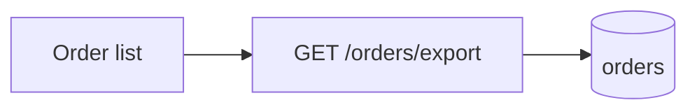

# Plan template

Load when writing the file. Copy everything below the line.

- Fill every section; delete the `<!-- -->` guidance as you go.
- A section that doesn't apply stays, with `N/A — <reason>`. In §5 keep only the blocks that apply (at least one).
- **Lite** tier: §5–7 become one `## 5. Design` — the §5 blocks that apply, the FR table (NFRs only if any),
  the file map, then key logic / edge cases; other §7 blocks only when they carry a decision. §10 is one
  line. Later sections move up (§8 → §6). Shape and density: [example.md](example.md).
- Translate headings and prose into the user's language; header keys, `Status` values, code, paths, and
  identifiers stay verbatim.
- IDs (G-, FR-, NFR-, AC-, A-, Q-) are stable across revisions — never renumber, strike through instead.

---

# <Title: what gets built, in plain words>

| | |
|---|---|
| Date | YY-MM-DD |
| Status | Draft |
| Revision | 1 |
| Repo | `<name>` @ `<branch>` (`<short sha>`) |
| Estimate | ~<hours> · <n> files · Lite / Full |
| Related | <other plans in docs/, issues, PRs — or none> |

<!-- Status: Draft → Confirmed when the user approves; Superseded (link the successor) when replaced. -->

> **Wish (verbatim):** <the user's original request, unedited>

## 1. TL;DR

<!-- ≤5 lines: what gets built, for whom, why now, and what is true once it ships. -->

## 2. Background

<!-- Current state with file refs (`src/orders/OrderList.tsx:42`), the problem, why now.
     Glossary: every domain term or acronym used below. -->

| Term | Meaning |
|---|---|
| | |

## 3. Goals / Non-goals

**Goals**

- G-1 <!-- an outcome someone can check, not a task -->

**Non-goals**

- <!-- what a reader might assume is included but is not -->

## 4. Users & scenarios

<!-- Primary user: role and context. Then 1–3 scenarios as numbered steps, happy path first. -->

## 5. Finished look

<!-- The section that answers “what does it look like”. Keep every block that applies. -->

**UI** — one wireframe per screen or region, then states and interactions.

```text
┌───────────────────────────────────────────────┐
│ Orders                           [Export CSV] │
├───────────────────────────────────────────────┤
│ #1024   Alice    ¥320.00   Paid               │
│ #1023   Bob      ¥ 89.00   Refunded           │
└───────────────────────────────────────────────┘
```

| State | What the user sees |
|---|---|
| Default | |
| Empty | |
| Loading | |
| Error | |
| Success | |

<!-- + key interactions (click X → Y) and narrow-screen behaviour. -->

**API** — endpoint table, then one real request / response per endpoint.

| Method | Path | Purpose |
|---|---|---|
| | | |

**CLI** — a sample terminal session: exact input, exact output.

**Library** — a usage snippet written from the caller's side.

**Data / infra** — before → after: schema, topology, or pipeline.

**Bug** — repro steps, expected vs actual.

**Refactor** — the caller-facing contract that must not change, then a before → after table per concern.

## 6. Requirements

| ID | Functional requirement — one observable behaviour | Priority |
|---|---|---|
| FR-1 | | Must |

<!-- Priority: Must / Should / Could. -->

| ID | Non-functional requirement — with a number |
|---|---|
| NFR-1 | <!-- e.g. exporting 50k rows finishes in < 10 s --> |

## 7. Technical design

**Architecture / flow**



<!-- mermaid or ASCII; trace one request / event end to end. -->

**File map**

| Path | Change | Why |
|---|---|---|
| `src/…` | modify | |
| `src/…` (new) | new | |

**Data model** <!-- schema / type changes, migrations -->

**Interfaces** <!-- API contracts, function signatures, events, config keys -->

**Key logic & edge cases**

| Case | Behaviour |
|---|---|
| | |

<!-- empty input, huge input, permissions, concurrency, partial failure, retries, timeouts -->

**Alternatives considered** <!-- one line each: option — why not -->

## 8. Implementation steps

| # | Step | Files | Depends on | Done when |
|---|---|---|---|---|
| 1 | | | — | |

<!-- Small, ordered, each independently verifiable. Group into milestones if large. -->

## 9. Testing & acceptance

**Acceptance criteria**

| ID | Given / When / Then | Covers |
|---|---|---|
| AC-1 | Given …, when …, then … | FR-1 |

**Automated tests** <!-- level (unit / integration / e2e), file, what it proves -->

**Manual check** <!-- exact commands or click path a reviewer follows to see it working -->

## 10. Rollout & risks

<!-- Migration, feature flag, backward compatibility, rollback. -->

| Risk | Likelihood | Impact | Mitigation |
|---|---|---|---|
| | | | |

## 11. Assumptions & open questions

| ID | Assumption | Why | To reverse |
|---|---|---|---|
| A-1 | | | |

| ID | Open question | Blocks | Owner |
|---|---|---|---|
| Q-1 | | | |

## 12. Changelog

- r1 YY-MM-DD — initial draft
